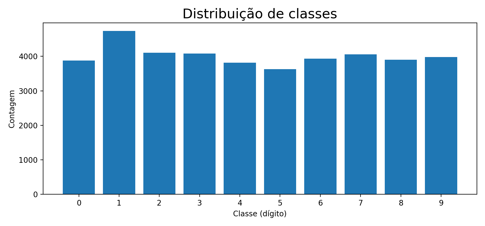

# Relatório — TP2 SAVI-MNIST  
## Tarefa 1: Classificação | Tarefa 2: Geração + Análise de Dataset “MNIST-Detection” | Tarefa 3: Sliding Window

> Texto formatado para copiares diretamente para o `README.md`.

---

## 1) Enquadramento e objetivo
Este trabalho evolui de **classificação** (MNIST clássico) para um cenário mais realista de **deteção** de múltiplos dígitos em imagens maiores.

- **Tarefa 1 (Classificação):** treinar e avaliar uma CNN para classificar dígitos 0–9, com métricas e visualizações (matriz de confusão, tabela de resultados).
- **Tarefa 2 (MNIST-Detection):** gerar “cenas” (ex.: 128×128) com dígitos espalhados e respetivas *bounding boxes*; analisar estatísticas do dataset.
- **Tarefa 3 (Sliding Window):** usar o classificador treinado na T1 para detetar dígitos nas “cenas” da T2, sem re-treinar a rede.

---

## 2) Organização do projeto (ficheiros considerados)

### Tarefa 1 — Classificação
- `main_classification.py` — ponto de entrada: cria dataset/modelo/trainer e executa treino + avaliação.
- `dataset.py` — carrega imagens e labels; devolve tensores para o `DataLoader`.
- `model.py` — define arquiteturas (ex.: `ModelBetterCNN`).
- `trainer.py` — treino, checkpoints, avaliação, matriz de confusão e tabela de métricas.

### Tarefa 2 — MNIST-Detection
- `generate_data.py` — gera imagens “cena” (ex.: 128×128) com dígitos e labels com *bounding boxes*.
- `main_dataset_stats.py` — calcula estatísticas e cria visualizações do dataset gerado.

### Tarefa 3 — Sliding Window
- `main_sliding_window.py` — percorre imagens da T2 com janelas em múltiplas escalas, classifica cada recorte com o modelo da T1 e desenha deteções.

---

# 3) Tarefa 1 — Classificação MNIST

## 3.1 Pipeline (`main_classification.py`)
O script:
1. Lê argumentos (dataset, nº épocas, batch size, pasta de resultados, etc.).
2. Cria os datasets de treino e teste com `Dataset(..., is_train=True/False)`.
3. Instancia o modelo (por defeito `ModelBetterCNN`).
4. Cria `Trainer(...)`, chama `train()` e depois `evaluate()`.

---

## 3.2 Dataset (`dataset.py`)
### Estrutura esperada
- `.../train/images/*.jpg`
- `.../train/labels.txt`
- `.../test/images/*.jpg`
- `.../test/labels.txt`

Em cada linha do `labels.txt`, o código usa o **2º campo** como classe.

### Saída do dataset
- Imagem: *grayscale* (`convert('L')`) + `ToTensor()`.
- Label: **one-hot** com 10 posições (classes 0–9).

> ⚠️ Observação: o dataset está reduzido a **10%** (via `len(self.images) * 0.1`). Para usar o MNIST completo, esta redução deve ser removida/ajustada.

---

## 3.3 Modelo (`ModelBetterCNN` em `model.py`)
Arquitetura em dois blocos:

### a) Extração de características (*features*)
- Conv(1→32) + BatchNorm + ReLU  
- Conv(32→32) + BatchNorm + ReLU  
- MaxPool (28→14) + Dropout2d  
- Conv(32→64) + BatchNorm + ReLU  
- Conv(64→64) + BatchNorm + ReLU  
- MaxPool (14→7) + Dropout2d  

### b) Classificador (*classifier*)
- Flatten  
- Linear(64·7·7 → 256) + BatchNorm1d + ReLU + Dropout  
- Linear(256 → 10)

---

## 3.4 Treino e checkpoints (`trainer.py`)
- `DataLoader` treino (shuffle=True) e teste (shuffle=False)
- Otimizador: **Adam** (lr=0.001)
- Loss: `MSELoss(softmax(logits), one-hot)`

Outputs típicos:
- `checkpoint.pkl` — estado completo do treino
- `best.pkl` — melhor modelo (pela loss de teste)
- `training.png` — gráfico de loss por época

---

## 3.5 Avaliação (`trainer.py`)
- Matriz de confusão (sklearn)
- Accuracy + Precision/Recall/F1 por classe + Média macro
- Outputs:
  - `statistics.json`
  - `confusion_matrix.png`
  - `results_table.png`

---

## 3.6 Resultados (espaço para imagens)
> Substitui os caminhos pelos que existirem na tua pasta de `experiments/`.

  
  


---

# 4) Tarefa 2 — MNIST-Detection (Geração do dataset)

## 4.1 Objetivo
Criar imagens “cena” (ex.: 128×128) com:
- 1 ou vários dígitos por imagem
- controlo de escala do dígito
- **sem sobreposição** entre *bounding boxes*
- labels em `.txt` com BBs

## 4.2 Geração (`generate_data.py`)
Resumo do método:
1. Cria um canvas `im` (zeros) com dimensão `imsize×imsize`.
2. Sorteia `n_digits` entre `min_digits_per_image` e `max_digits_per_image`.
3. Para cada dígito tenta colocar sem sobreposição usando IoU (`max(IoU)==0`).
4. Ajusta a bbox ao “conteúdo” (*tight bbox*) e cola no canvas.

Formato das labels:
label, xmin, ymin, xmax, ymax
2, 83, 95, 99, 111

## 4.3 Como gerar as versões A–D (exemplos)
- **A** (1 dígito, sem escala): `--min-digits-per-image 1 --max-digits-per-image 1 --min-digit-size 22 --max-digit-size 22`
- **B** (1 dígito, com escala): `--min-digits-per-image 1 --max-digits-per-image 1 --min-digit-size 22 --max-digit-size 36`
- **C** (3–5 dígitos, sem escala): `--min-digits-per-image 3 --max-digits-per-image 5 --min-digit-size 22 --max-digit-size 22`
- **D** (3–5 dígitos, com escala): `--min-digits-per-image 3 --max-digits-per-image 5 --min-digit-size 22 --max-digit-size 36`

---

# 5) Tarefa 2 — Estatísticas e visualização (`main_dataset_stats.py`)

## 5.1 Estatísticas calculadas
- nº de imagens analisadas e nº de labels em falta
- nº total de dígitos e **distribuição por classe**
- histograma do **nº de dígitos por imagem**
- estatísticas das BBs (largura/altura/área: média e mediana)
- área média por classe  
Além disso, guarda um `estatisticas.json`.

## 5.2 Figuras geradas (tipicamente)
- `bboxes.png` — mosaico com bounding boxes e labels
- `class_distribution.png` — distribuição por classe
- `digits_per_image.png` — histograma de dígitos por imagem
- `bbox_area.png` — histograma da área das BBs
- `mean_bbox_area_per_class.png` — área média por classe
- `estatisticas.png` — colagem com as figuras anteriores

## 5.3 Espaço para imagens do dataset
  
  


---

# 6) Tarefa 3 — Deteção por Janela Deslizante (`main_sliding_window.py`)

## 6.1 Objetivo
Detetar dígitos nas imagens da Tarefa 2 **sem re-treinar** a rede: usa-se o classificador da Tarefa 1 como “detetor” ao correr uma janela deslizante (*sliding window*) e selecionar regiões com alta confiança.

## 6.2 Ideia geral do algoritmo
Para cada imagem:
1. Converte para grayscale (se vier RGB).
2. Percorre a imagem com janelas quadradas em **múltiplas escalas**:
   - `WINDOW_SIZES = [22, 26, 28, 32, 36]` (compatível com os tamanhos gerados na T2).
3. Usa um **stride** (passo) pequeno para maior precisão (default `stride=2`).
4. Aplica heurísticas para rejeitar “fundo” antes de chamar a rede:
   - ignora recortes com `crop.mean() < 0.05` **ou** `crop.max() < 0.3`
   - exige uma **margem preta** (1 pixel) no recorte (`has_black_margin`) para reduzir falsos positivos
5. Redimensiona cada recorte para **28×28** e classifica em batch:
   - calcula `softmax(logits)` e usa o **score máximo** como confiança
6. Remove deteções redundantes:
   - **Non-Max Suppression (NMS)** com `iou_thresh=0.3` (mantém a deteção com maior score quando há sobreposição)
   - supressão adicional por proximidade (`suppress_nearby`, `min_distance=22`) para reduzir duplicados muito próximos
7. Desenha as BBs finais na imagem (retângulos “lime”).
8. Opcional: com `--show_digits`, escreve também o dígito previsto junto à bbox.

## 6.3 Outputs (visualização)
O script mostra as deteções com `matplotlib` (por defeito com `plt.show()`).
> Para relatório/README, o normal é guardar screenshots/exports destas figuras.

## 6.4 Espaço para exemplos de deteção (README)
> Coloca aqui imagens exportadas das janelas do `matplotlib`.

  


---

# 7) Como executar (comandos típicos)

## 7.1 Tarefa 1 — Treino + Avaliação
```bash
python3 main_classification.py -df ../mnist -ne 10 -bs 64 -ep ./experiments
