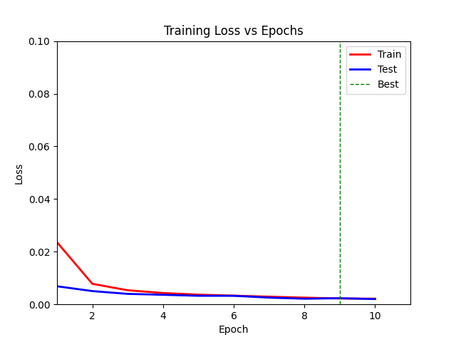
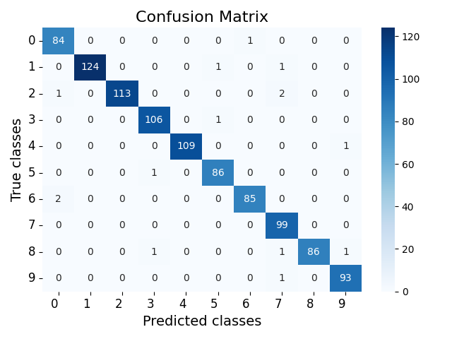
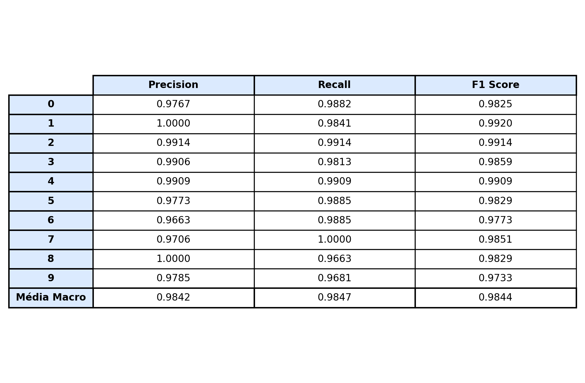
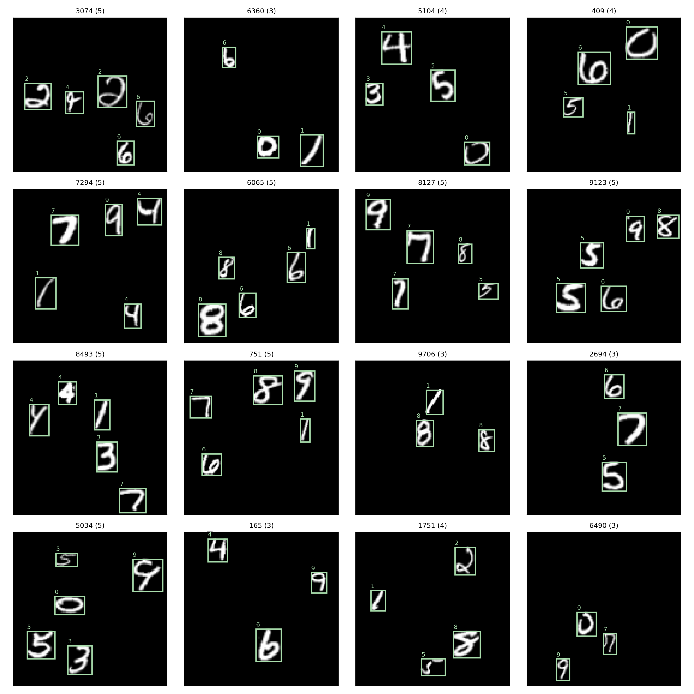
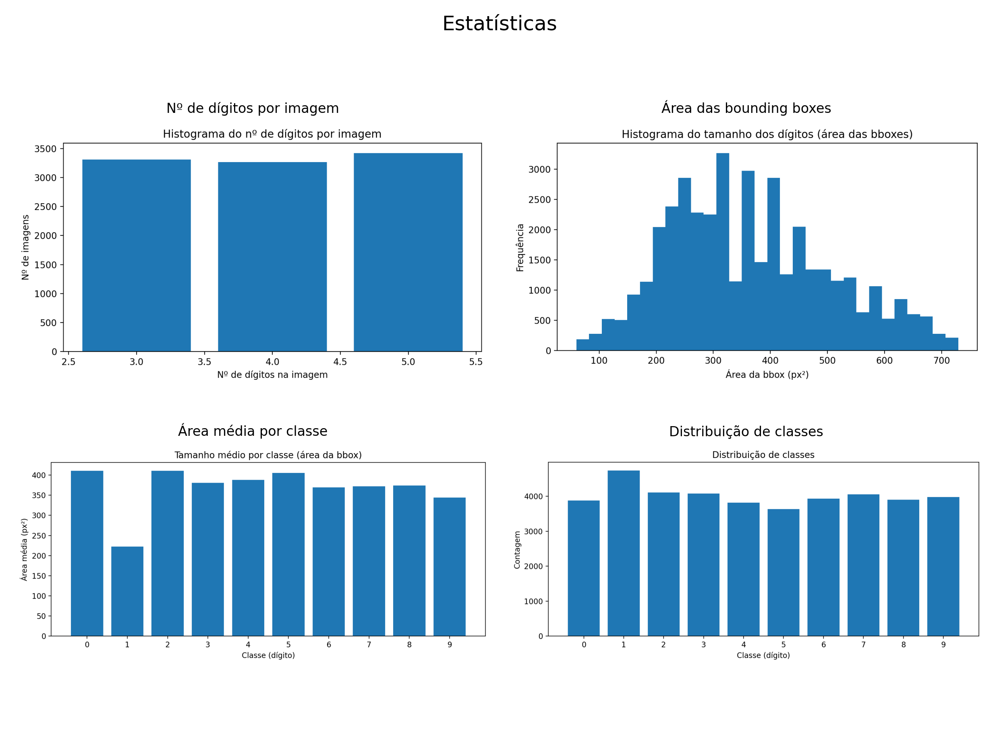
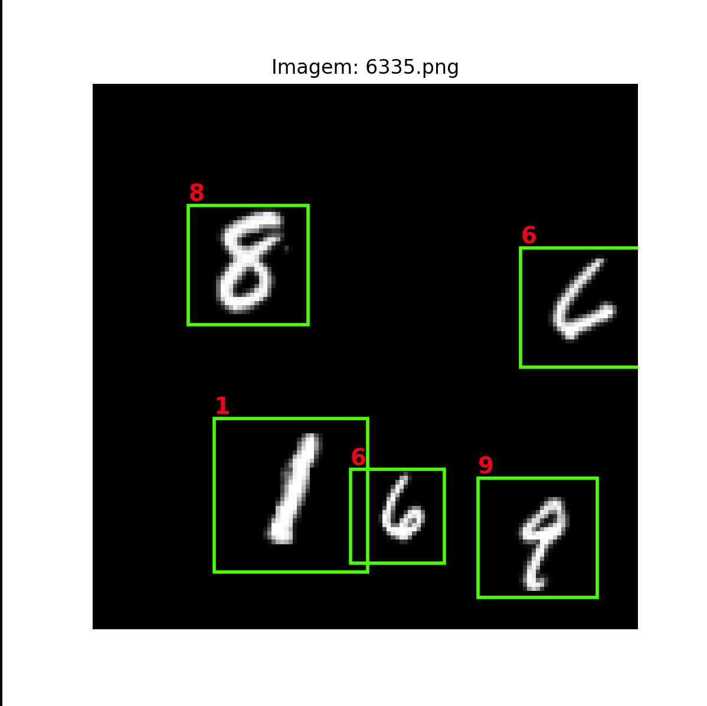
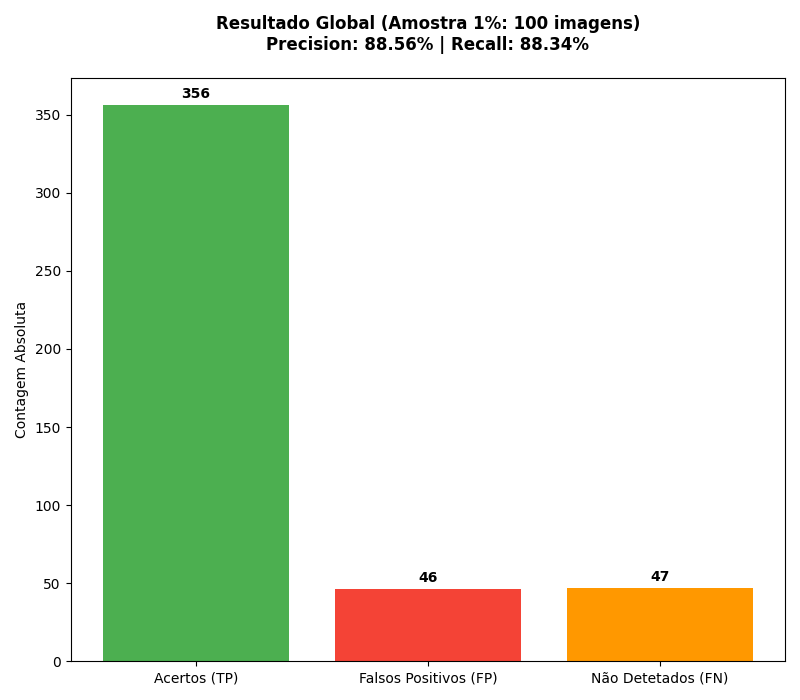

# Relatório — TP2 SAVI-MNIST  

## 1. Enquadramento e objetivo
Este trabalho evolui de **classificação** (MNIST clássico) para um cenário mais realista de **deteção** de múltiplos dígitos em imagens maiores. Está dividido nas seguintes tarefas:

- **Tarefa 1 (Classificação):** treinar e avaliar uma CNN para classificar dígitos 0–9, com métricas e visualizações (matriz de confusão, tabela de resultados).
- **Tarefa 2 (MNIST-Detection):** gerar imagens (128×128) com dígitos espalhados e respetiva análise através de *bounding boxes* e estatísticas do dataset.
- **Tarefa 3 (Sliding Window):** usar o classificador treinado na tarefa 1 para detetar dígitos nas iamgens geradas na tarefa 2, sem re-treinar a rede.

---

## 2. Organização do projeto - ficheiros considerados

### Tarefa 1 — Classificação
- `main_classification.py` — ponto de entrada: cria dataset, modelo e trainer para executar o treino e a avaliação.
- `dataset.py` — carrega imagens e labels; devolve tensores para o `DataLoader`.
- `model.py` — define arquiteturas (ex.: `ModelBetterCNN`).
- `trainer.py` — treino, checkpoints, avaliação, matriz de confusão e tabela de métricas.

### Tarefa 2 — MNIST-Detection
- `generate_data.py` — gera imagens de 128×128 com dígitos e labels com *bounding boxes*.
- `main_dataset_stats.py` — calcula estatísticas e cria visualizações do dataset gerado.

### Tarefa 3 — Sliding Window
- `main_sliding_window.py` — percorre imagens da tarefa 2 com janelas em múltiplas escalas, classifica cada recorte com o modelo da tarefa 1 e desenha as deteções encontradas.

---

## 3. Tarefa 1 — Classificação MNIST

### 3.1. Scripts
### `main_classification.py`:
1. Lê argumentos (dataset, nº épocas, batch size, pasta de resultados, etc.).
2. Cria os datasets de treino e teste com `Dataset(..., is_train=True/False)`.
3. Escolhe o modelo (por defeito `ModelBetterCNN`).
4. Cria `Trainer(...)`, chama `train()` e depois `evaluate()`.

---
### `dataset.py`;

Estrutura esperada:
- `.../train/images/*.jpg`
- `.../train/labels.txt`
- `.../test/images/*.jpg`
- `.../test/labels.txt`

Em cada linha do `labels.txt`, o código usa o **2º campo** como classe.

Saída do dataset:
- Imagem: *grayscale* (`convert('L')`) + `ToTensor()`.
- Label: **one-hot** com 10 posições (classes 0–9).

---

### `model.py`:

O melhor modelo desenvolvido foi `ModelBetterCNN` e divide-se em dois blocos:

#### a) Extração de características (*features*)
- Conv(1→32) + BatchNorm + ReLU  
- Conv(32→32) + BatchNorm + ReLU  
- MaxPool (28→14) + Dropout2d  
- Conv(32→64) + BatchNorm + ReLU  
- Conv(64→64) + BatchNorm + ReLU  
- MaxPool (14→7) + Dropout2d  

#### b) Classificador (*classifier*)
- Flatten  
- Linear(64·7·7 → 256) + BatchNorm1d + ReLU + Dropout  
- Linear(256 → 10)

---

### `trainer.py`:
- `DataLoader` treino (shuffle=True) e teste (shuffle=False)
- Otimizador: **Adam** (lr=0.001)
- Loss: `MSELoss(softmax(logits), one-hot)`

Outputs típicos:
- `checkpoint.pkl` — estado completo do treino
- `best.pkl` — melhor modelo (pela loss de teste)
- `training.png` — gráfico de loss por época

---

## 3.2. Resultados (espaço para imagens)
- Matriz de confusão (sklearn)
- Accuracy + Precision/Recall/F1 por classe + Média macro
- Outputs:
  - `statistics.json`
  - `confusion_matrix.png`
  - `results_table.png`

---
  
  

---

# 4. Tarefa 2 — MNIST-Detection (gerar novo dataset)

## 4.1. Objetivo
Criar imagens de 128×128 com:
- 1 ou vários dígitos por imagem
- controlo de escala do dígito
- **sem sobreposição** de números
- labels em `.txt` com BBs

## 4.2. Gerar dataset (`generate_data.py`)
Resumo do método:
1. Cria uma imagem preta `im` com dimensão `imsize×imsize`.
2. Sorteia `n_digits` entre `min_digits_per_image` e `max_digits_per_image`.
3. Para cada dígito tenta colocar sem sobreposição usando IoU (`max(IoU)==0`).
4. Ajusta a bbox ao “conteúdo”  cola na imagem.

Formato das labels:
label, xmin, ymin, xmax, ymax
2, 83, 95, 99, 111

## 4.3. Estatísticas calculadas
- nº de imagens analisadas e nº de labels em falta
- nº total de dígitos e **distribuição por classe**
- histograma do **nº de dígitos por imagem**
- estatísticas das BBs (largura/altura/área: média e mediana)
- área média por classe  
Além disso, guarda um `estatisticas.json`.

## 4.4. Figuras geradas
- `bboxes.png` — mosaico com bounding boxes e labels
- `class_distribution.png` — distribuição por classe
- `digits_per_image.png` — histograma de dígitos por imagem
- `bbox_area.png` — histograma da área das BBs
- `mean_bbox_area_per_class.png` — área média por classe
- `estatisticas.png` — colagem com as figuras anteriores

  

---

# 6. Tarefa 3 — Deteção por Janela Deslizante (`main_sliding_window.py`)

## 6.1. Objetivo
Detetar dígitos nas imagens da tarefa 2 sem re-treinar a rede: usa-se o classificador da tarefa 1 como “detetor” ao correr uma janela deslizante e selecionar as regiões com alta confiança.

## 6.2. Ideia geral do algoritmo
Para cada imagem:
1. Converte para grayscale (se vier RGB).
2. Percorre a imagem com janelas quadradas de **várias escalas**:
   - `WINDOW_SIZES = [22, 26, 28, 32, 36]` (compatível com os tamanhos gerados na T2).
3. Usa um **stride** (passo) pequeno para maior precisão (default `stride=2`).
4. Aplica heurísticas para rejeitar “fundo” antes de chamar a rede:
   - ignora recortes com `crop.mean() < 0.05` ou `crop.max() < 0.3`
   - exige uma margem preta de 1 pixel no recorte (`has_black_margin`) para reduzir falsos positivos
5. Redimensiona cada recorte para **28×28** e classifica em batch:
   - calcula `softmax(logits)` e usa o **score máximo** como confiança
6. Remove deteções redundantes:
   - **Non-Max Suppression (NMS)** com `iou_thresh=0.3` (mantém a deteção com maior score quando há sobreposição)
   - supressão adicional por proximidade (`suppress_nearby`, `min_distance=22`) para reduzir duplicados muito próximos
7. Desenha as BBs finais na imagem (retângulos “lime”).
8. Extra(opcional): com `-sd` ou `--show_digits`, escreve também a previsão do dígito, no canto superior esquerdo, junto à bbox.

## 6.3. Outputs (visualização)
O script mostra as deteções com `matplotlib` (por defeito com `plt.show()`).

  

## 6.4. Avaliação qualitativa

### Eficiência
A abordagem de *sliding window* é simples e funciona sem treinar um detetor dedicado, mas é **computacionalmente pesada** porque testa muitas janelas por imagem.

- A complexidade cresce aproximadamente com o nº de posições da grelha:
  
  $n_\text{janelas} \approx \sum_{l} \left(\left\lfloor\frac{H-l}{s}\right\rfloor+1\right)\left(\left\lfloor\frac{W-l}{s}\right\rfloor+1\right)$,
  
  sendo $H$ a altura da imagem (em píxeis), $W$ a largura da imagem (em píxeis), $l$ o tamanho da janela (assumida quadrada, $w \times w$) e $s$ o *stride* (passo) da janela.

- Exemplo típico (imagens **128×128**, `stride=2`, `WINDOW_SIZES=[22,26,28,32,36]`):
  - nº de janelas ≈ **12 831 por imagem** (antes de qualquer filtragem).
- O custo real depende muito de:
  - `stride` (menor = muito mais lento),
  - nº de tamanhos de janelas testadas (`WINDOW_SIZES`),
  - execução em CPU vs GPU,
  - quanto é filtrado antes da rede (heurísticas de fundo/margem).

**Bottlenecks práticos**
- Loops em Python + *crop* + *resize* (28×28) repetidos milhares de vezes.
- *Forward pass* do modelo (mesmo em batch, continua a ser o maior custo quando muitas janelas passam os filtros).

**Como melhorar (trade-off tempo vs qualidade)**
- Aumentar `stride` (ex.: 4) → muito mais rápido, mas pior localização.
- Reduzir escalas (ex.: só 22 e 36) → menos janelas.
- Subir o limiar de confiança → menos *candidates* para NMS.
- Vetorizar a extração de janelas (ex.: `torch.nn.Unfold`) e correr tudo em GPU.
- (Melhor solução) Treinar um detetor (mesmo simples) em vez de usar sliding window.

---

### Problemas encontrados

#### 1) Falsos positivos
É comum aparecerem deteções em regiões que **não são dígitos**, porque:
- O classificador da T1 **nunca viu “fundo” como classe** (não existe classe “background”).
- Pequenas estruturas/brilhos/fragmentos podem parecer “traços” de dígitos após `resize` para 28×28.
- Janelas que apanham **apenas parte** de um dígito (ou mistura de 2 dígitos) podem ser classificadas com confiança.

O código tenta reduzir isto com heurísticas (ex.: rejeitar crops muito escuros e exigir “margem preta”), mas:
- Pode **eliminar verdadeiros positivos** (dígitos mais finos/fracos),
- E ainda deixa passar alguns falsos positivos.

#### 2) Precisão de localização (bounding boxes)
Mesmo quando o dígito é detetado corretamente, a bbox pode ficar **pouco precisa**:
- A janela é **quadrada e de tamanho fixo** (por escala) → tende a ficar “larga” e não *tight*.
- A grelha é discreta: com `stride=2`, a bbox só pode “mexer” de 2 em 2 píxeis → erro de quantização.
- Dígitos perto das bordas ou muito próximos podem gerar bboxes sobrepostas e/ou deslocadas.

Na imagem de exemplo, nota-se:
- Bboxes **maiores do que o necessário** (ex.: no “1”),
- **Sobreposições** entre deteções (ex.: “6” perto do “1”), mesmo após NMS,
- Algumas bboxes apanharem mais fundo do que dígito → pior para avaliar IoU com GT.

#### 3) Duplicados e conflitos entre deteções
Como várias janelas diferentes conseguem “ver” o mesmo dígito:
- aparecem múltiplas bboxes para o mesmo objeto.
- O NMS ajuda, mas pode falhar quando:
  - as caixas têm IoU baixo (desalinhadas),
  - ou quando há dígitos próximos (pode suprimir o dígito errado).

---

### Conclusão
O *sliding window* é uma boa prova de conceito (usa diretamente o classificador da T1), mas:
- **não é eficiente** para muitas imagens (custo cresce muito com stride pequeno e várias escalas),
- tem **falsos positivos** por falta de “background”,
- e a **localização não é tight** por depender de janelas quadradas e de uma grelha discreta.

Para resultados robustos e rápidos, o ideal é evoluir para um modelo de deteção treinado (mesmo simples) ou incorporar uma etapa explícita de “background rejection” aprendida (ex.: classe extra, ou um *proposal stage*).

